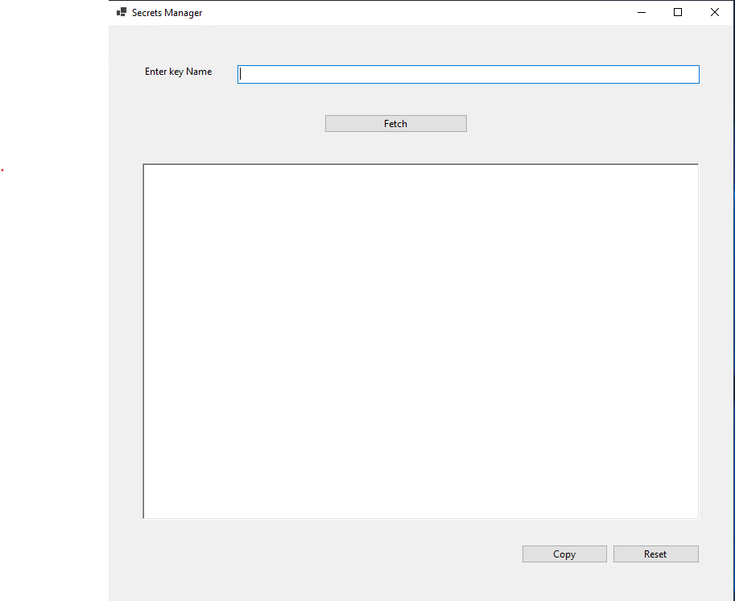

# AWSSecretsManager

This tool is built on .Net 7.0 , with its current publish setting ,gets published as a self contained which can copied to any windows 64 machine and started by launching <b> FetchSecretManager.exe</b>


## Home page snapshot




# Steps

## Step 1 : Download the application


<a id="raw-url" href="https://downgit.github.io/#/home?url=https://github.com/ShahidRKhan/AWSSecretsManager/blob/main/FetchSecrets.zip"  target="_blank" >Download Exe</a>

<a id="raw-url" href="https://shahidrkhan.github.io/AWSSecretsManager/FetchSecrets.zip"  target="_blank" >Download </a>


## Step 2 : Extract the zip to any folder

## Step 3 : Launch  FetchSecretManager.exe

## Step 4: enter the key name 

> Sample cert/nhe/hesi/testtaker/config


## Step 5:  Hit Fetch


``` json

    Data will be displayed in the text below

```

## Step 6:  Click Copy to add to Clipboard


